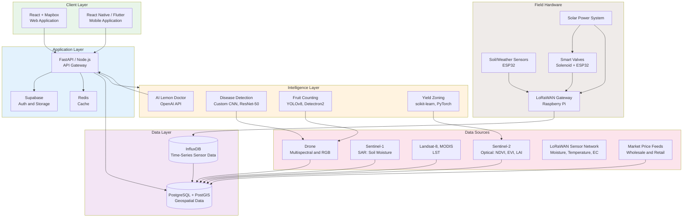
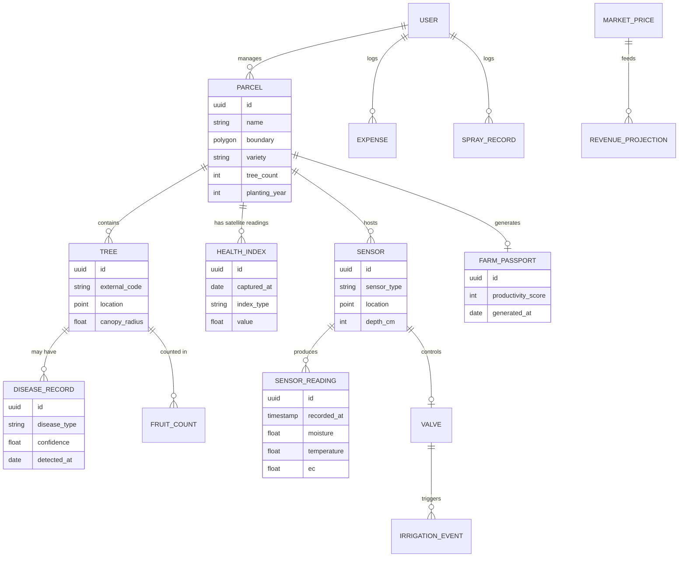
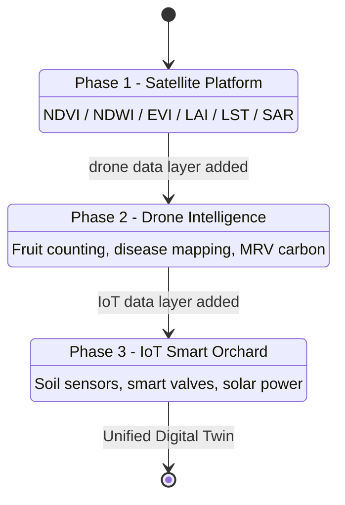
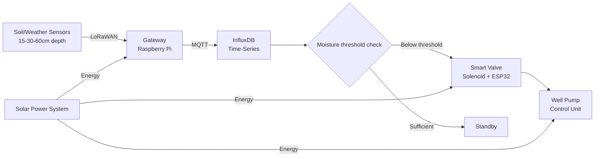
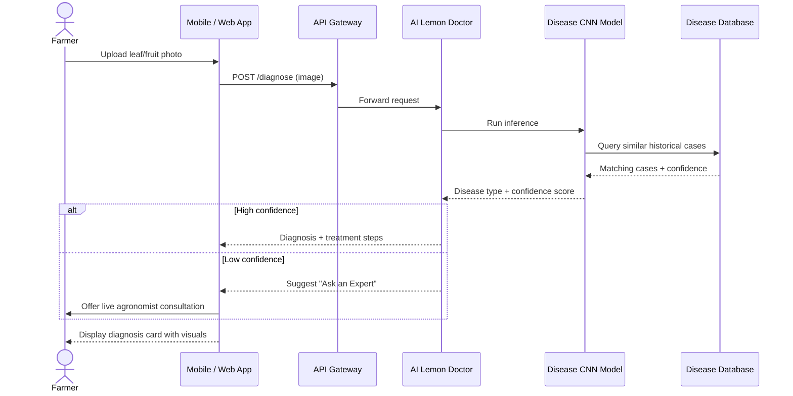
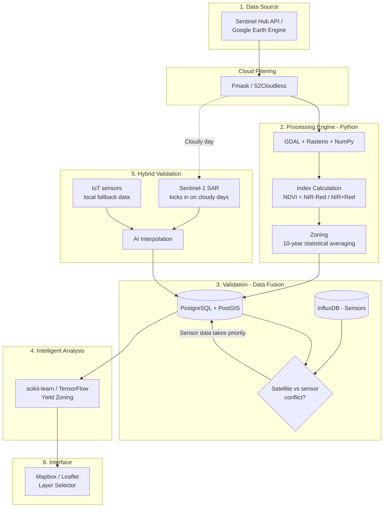
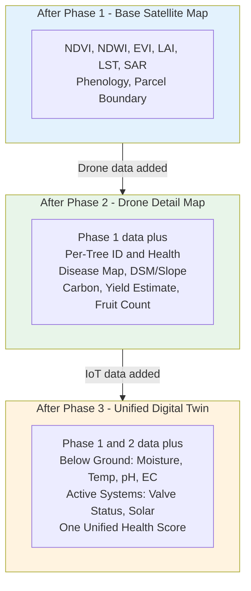

# 🍋 Garden Digital Twin

**An intelligent agriculture platform that fuses satellite imagery, drone mapping, and IoT sensor networks into a single digital twin for citrus orchards**

[](#-project-roadmap-3-phase-development)
[](#-project-roadmap-3-phase-development)
[](#-license)
[](#-tech-stack)
[](#-system-architecture)
[](#-contributing)

---

## 📖 Table of Contents

- [Overview](#-overview)
- [Why This Project?](#-why-this-project)
- [System Architecture](#-system-architecture)
- [Data Model](#-data-model)
- [Phased Feature Roadmap](#-phased-feature-roadmap)
  - [Phase 1 — Platform (Web + Mobile)](#phase-1--platform-web--mobile)
  - [Phase 2 — Drone-Based Mapping & Yield Intelligence](#phase-2--drone-based-mapping--yield-intelligence)
  - [Phase 3 — IoT, Sensors & Smart Irrigation](#phase-3--iot-sensors--smart-irrigation)
- [AI Disease Diagnosis Flow](#-ai-disease-diagnosis-flow)
- [Data Processing Pipeline](#-data-processing-pipeline)
- [Satellite Health Score — 8-Layer Analysis](#-satellite-health-score--8-layer-analysis)
- [Map Layer Evolution](#-map-layer-evolution-across-3-phases)
- [Tech Stack](#-tech-stack)
- [Project Structure](#-project-structure)
- [Getting Started](#-getting-started)
- [Project Roadmap](#-project-roadmap-3-phase-development)
- [Vision](#-vision)
- [Contributing](#-contributing)
- [License](#-license)
- [Contact](#-contact)

---

## 🎯 Overview

**Garden Digital Twin** is an end-to-end digital twin platform for citrus orchards. It brings together satellite remote sensing, drone-based precision agriculture, and IoT sensor networks through a **three-phase roadmap**, converging on a single unified orchard map:

> **Above ground** (satellite + drone) + **Below ground** (soil sensors) + **Active systems** (smart irrigation) = **One unified health score**

Each phase is developed and validated independently, then layered on top of the previous phase's data — allowing the platform to grow from a lightweight web/mobile MVP into a fully autonomous, solar-powered smart orchard system. The architecture is designed to generalize across climates, orchard sizes, and citrus varieties rather than being tied to a single deployment.

---

## 🌱 Why This Project?

Traditional citrus farming faces recurring, costly problems that satellite, drone, and IoT data can solve when properly fused:

| Problem | Garden Digital Twin Solution |
|---|---|
| Disease and water stress are detected too late; the whole orchard can't be walked daily | Satellite-based NDVI/NDWI heatmaps for early, bird's-eye detection |
| Harvest volume and revenue are hard to forecast | Drone + YOLO object detection for per-tree fruit counting and revenue projection |
| Spraying is applied to the entire orchard, driving up cost and environmental impact | Disease-map-driven spraying plans that target only affected zones |
| Irrigation is guesswork, leading to water waste | IoT moisture sensors and smart valves enable millimeter-precise, zone-based irrigation |
| Growers lack documented proof of yield/quality for banks or export buyers | Farm Passport: a PDF report backed by historical satellite productivity scoring |
| Farmers can't get expert help instantly | 24/7 AI Lemon Doctor chatbot, with escalation to a live agronomist when needed |

---

## 🏗️ System Architecture

### High-Level Overview

```
┌──────────────────────────────────────────────────────────────────────────────┐
│                         GARDEN DIGITAL TWIN PLATFORM                         │
│           Satellite + Drone + IoT Digital Twin for Citrus Orchards           │
│                                                                              │
│                     ┌──────────────────────────────────┐                     │
│                     │        UNIFIED DASHBOARD         │                     │
│                     │     React Web  +  Mobile App     │                     │
│                     └────────────────┬─────────────────┘                     │
│                                      │                                       │
│             │                         │                         │            │
│             ▼                         ▼                         ▼            │
│  ┌────────────────────┐    ┌────────────────────┐    ┌────────────────────┐  │
│  │      MY FARM       │    │    MARKETPLACE     │    │     AI SUPPORT     │  │
│  │  Farm Management   │    │Market Intelligence │    │ Technical Support  │  │
│  └────────────────────┘    └────────────────────┘    └────────────────────┘  │
│             │                         │                         │            │
│             └─────────────────────────┴─────────────────────────┘            │
│                                       ▼                                      │
│  ┌────────────────────────────────────────────────────────────────────────┐  │
│  │                  AI & DATA LAYER  —  FastAPI + Python                  │  │
│  │                                                                        │  │
│  │            ┌─────┐ ┌─────┐ ┌─────┐ ┌─────┐ ┌─────┐ ┌─────┐             │  │
│  │            │ NDVI│ │ NDWI│ │ EVI │ │ LAI │ │ LST │ │ SAR │             │  │
│  │            └─────┘ └─────┘ └─────┘ └─────┘ └─────┘ └─────┘             │  │
│  │                                                                        │  │
│  │                 ┌──────────┐ ┌──────────┐ ┌──────────┐                 │  │
│  │                 │Phenology │ │  YOLOv8  │ │Custom CNN│                 │  │
│  │                 └──────────┘ └──────────┘ └──────────┘                 │  │
│  │                                                                        │  │
│  └────────────────────────────────────────────────────────────────────────┘  │
│                                       ▼                                      │
│  ┌────────────────────────────────────────────────────────────────────────┐  │
│  │                     DATA SOURCES & FIELD HARDWARE                      │  │
│  │                                                                        │  │
│  │ ┌───────────┐ ┌───────────┐ ┌───────────┐ ┌───────────┐ ┌───────────┐  │  │
│  │ │  Sentinel │ │    DJI    │ │    IoT    │ │    HKS    │ │  Weather  │  │  │
│  │ │   1 / 2   │ │   Drone   │ │  Sensors  │ │    API    │ │    API    │  │  │
│  │ └───────────┘ └───────────┘ └───────────┘ └───────────┘ └───────────┘  │  │
│  │                                                                        │  │
│  └────────────────────────────────────────────────────────────────────────┘  │
│                                                                              │
└──────────────────────────────────────────────────────────────────────────────┘
```

### Detailed Component Diagram



---

## 🗃️ Data Model

A logical entity-relationship view of the core domain objects the platform manages across all three phases.



---

## 📦 Phased Feature Roadmap

The platform is built in **three independent phases**; each phase is completed, validated, and then fused with the previous phase's data layer.

```mermaid
gantt
    title Garden Digital Twin - Development Phases
    dateFormat  X
    axisFormat  %s
    section Phase 1
    Platform (Web + Mobile)         :active, f1, 0, 3
    section Phase 2
    Drone & Yield Intelligence      :f2, after f1, 3
    section Phase 3
    IoT & Smart Irrigation          :f3, after f2, 3
```





### Phase 1 — Platform (Web + Mobile)

**Goal:** A satellite-data-driven MVP that delivers value from day one.

<details>
<summary><b>🗺️ My Farm — Digital Operations Center</b></summary>

- Draw and save parcel boundaries (polygons) on the map, log tree count/variety/age
- **8-layer satellite health analysis:** NDVI, NDWI, EVI, LAI, LST, SAR soil moisture, Phenology (seasonal tracking), 10-year time-series trend analysis
- **Farm Passport:** historical productivity score (out of 100), exportable as a PDF proof document for banks or leasing
- Labor and financial tracking (wages, expenses, profit/loss)
- **Application Logbook:** barcode scanning for pesticide/dosage logging, EU export-compliant traceability report
- Offline field notebook (photo/voice notes, auto-sync when back online)
</details>

<details>
<summary><b>📈 Market & News Intelligence</b></summary>

- **Lemon Exchange:** wholesale market price tracking combined with retail price scraping from major grocery chains
- Global sector bulletin (harvest and price trends from major producing countries)
- Local sector bulletin (trade fairs, government subsidies)
- AI News Assistant: summarizes how a given news item affects the grower, in two sentences
</details>

<details>
<summary><b>🩺 Technical Support & Expertise</b></summary>

- **AI Lemon Doctor:** a Sola-style chatbot interface with photo-based disease diagnosis
  - Detected diseases: Thrips, Citrus Psylla, Spider Mite, Root Rot, Citrus Canker
- Ask an Expert: escalation to a live agronomist appointment when AI cannot resolve the issue
- Disease image database (used as Phase 2 AI model training data)
</details>

<details>
<summary><b>⚖️ Decision Support & Efficiency</b></summary>

- Orchard-specific pruning/irrigation/harvest calendar with push notifications
- Precision dosage calculator (tree count × variety × pesticide brand)
- PHI (Pre-Harvest Interval) countdown with EU MRL compliance warnings
- Comparative meteorology, frost/disaster risk alerts, 7-day detailed forecast
</details>

<details>
<summary><b>👥 Community, Education & Government Integration</b></summary>

- Agri-Academy: certified 1-minute micro-learning videos on pruning, disease control, fertilization
- Service and equipment directory (tractor operators, fertilizer dealers, logistics providers)
- Farmer Forum: moderated peer knowledge-sharing space
- **Government integration:** national agricultural registry sync, subsidy application tracking, crop insurance tracking
- Wholesale market integration and cold-storage facility tracking
</details>

### Phase 2 — Drone-Based Mapping & Yield Intelligence

**Goal:** Turn the orchard into a machine that produces a harvest plan, not just a map.

| Module | Technology | Output |
|---|---|---|
| **Fruit Counting** | YOLOv8 / Faster R-CNN, 50–80m altitude, orthomosaic stitching | Per-tree fruit count, total yield estimate (high accuracy) |
| **Size & Ripeness Analysis** | RGB→HSV pixel/color analysis | Export-grade / domestic / industrial quality distribution |
| **Revenue Projection** | Wholesale + retail price feed integration | Optimistic / realistic / pessimistic scenario revenue dashboard |
| **Per-Tree Numbering** | Computer vision + RTK GPS | Unique tree ID, centimeter-accurate location |
| **DSM/DTM Analysis** | Photogrammetry | Slope, water-flow direction, erosion risk, canopy volume |
| **Disease Detection** | Custom CNN (ResNet-50 backbone) | Per-tree disease map with spread direction and hotspot analysis |
| **Automated Spray Planning** | Disease map → dosage engine | Targeted spraying of only affected zones, cutting pesticide, time, and water use |
| **Carbon (MRV)** | DSM volume model + input-based emissions calculation | Verra VCS / Gold Standard-compliant PDF report, carbon credit potential |

### Phase 3 — IoT, Sensors & Smart Irrigation

**Goal:** A fully autonomous, solar-powered smart orchard.



- **Sensor Network:** moisture, temperature, and EC at 3 depths (15/30/60cm); weather station
- **LoRaWAN Communication:** low-power, long-range data flow even in orchards without internet coverage
- **Smart Valve:** zone-based automated irrigation with manual override
- **Well/Pump Control:** dry-run, over-pressure, and voltage protection
- **Solar Power System:** grid-independent, battery-backed operation
- **Data Monetization:** anonymized data sales (to meteorology, fertilizer, pesticide, and insurance companies), cooperative reports, carbon credit advisory
- **SaaS/Platform Expansion:** tiered subscription plans, white-label cooperative solution, API ecosystem

---

## 🤖 AI Disease Diagnosis Flow

How a photo submitted by a grower becomes an actionable diagnosis.



---

## 🔄 Data Processing Pipeline



**Core principle:** Satellite data alone is an *estimate*. To turn it into *ground truth*, it is cross-validated against IoT sensor data — and in case of conflict, sensor data wins, since it measures 30cm below the surface directly.

---

## 🛰️ Satellite Health Score — 8-Layer Analysis

| # | Index | Measures | Formula / Method | Source |
|---|---|---|---|---|
| 1.1 | **NDVI** | Vegetation health/density | `(NIR - Red) / (NIR + Red)` | Sentinel-2 B8/B4 |
| 1.2 | **NDWI** | Water content | `(NIR - SWIR) / (NIR + SWIR)` | Sentinel-2 B8/B11 |
| 1.3 | **EVI** | Enhanced vegetation health (dense planting) | `2.5 × (NIR-Red)/(NIR+6×Red-7.5×Blue+1)` | Sentinel-2 |
| 1.4 | **LAI** | Leaf density / photosynthetic capacity | PROSAIL model / NDVI-LAI regression | Sentinel-2 B3/B4/B5 |
| 1.5 | **LST** | Land surface temperature | Split-Window algorithm | Landsat-8 TIRS / MODIS |
| 1.6 | **SAR Soil Moisture** | Moisture level beneath cloud cover | Water Cloud Model | Sentinel-1 VV/VH |
| 1.7 | **Phenology** | Flowering/harvest period detection | Savitzky-Golay filtering (SOS/EOS) | NDVI time series |
| 1.8 | **Time-Series Trend** | Monthly/yearly growth comparison | 10-year statistical zoning | All indices |

---

## 🗺️ Map Layer Evolution Across 3 Phases



---

## 🧰 Tech Stack

<table>
<tr><th>Layer</th><th>Phase</th><th>Technologies</th></tr>
<tr><td><b>Backend</b></td><td>1</td><td>FastAPI (Python) / Node.js</td></tr>
<tr><td><b>Database</b></td><td>1</td><td>PostgreSQL + PostGIS (geospatial data)</td></tr>
<tr><td><b>Cache</b></td><td>1</td><td>Redis</td></tr>
<tr><td><b>Auth & Storage</b></td><td>1</td><td>Supabase</td></tr>
<tr><td><b>Frontend Web</b></td><td>1</td><td>React + Mapbox</td></tr>
<tr><td><b>Frontend Mobile</b></td><td>1</td><td>React Native / Flutter</td></tr>
<tr><td><b>AI (Chatbot/Summarization)</b></td><td>1</td><td>OpenAI API</td></tr>
<tr><td><b>Scraping</b></td><td>1</td><td>Scrapy</td></tr>
<tr><td><b>Satellite Data</b></td><td>1</td><td>Sentinel-2 API, Sentinel-1 SAR API, MODIS/Landsat</td></tr>
<tr><td><b>Drone SDK</b></td><td>2</td><td>DJI SDK / Pix4D</td></tr>
<tr><td><b>Image Processing</b></td><td>2</td><td>OpenCV, TensorFlow</td></tr>
<tr><td><b>Mapping</b></td><td>2</td><td>OpenDroneMap / QGIS</td></tr>
<tr><td><b>Disease Detection</b></td><td>2</td><td>Custom CNN (ResNet-50 backbone, transfer learning)</td></tr>
<tr><td><b>Object Detection</b></td><td>2</td><td>YOLOv8 / Detectron2</td></tr>
<tr><td><b>Sensor Communication</b></td><td>3</td><td>LoRaWAN (SX1276/SX1262)</td></tr>
<tr><td><b>Gateway</b></td><td>3</td><td>Raspberry Pi + LoRaWAN HAT / TTN Gateway</td></tr>
<tr><td><b>Real-time Data</b></td><td>3</td><td>MQTT + InfluxDB (time-series)</td></tr>
<tr><td><b>Edge Computing</b></td><td>3</td><td>ESP32</td></tr>
<tr><td><b>Power</b></td><td>3</td><td>Solar panel + MPPT + LiFePO4 battery</td></tr>
<tr><td><b>Weather API</b></td><td>All</td><td>OpenWeatherMap / Meteoblue</td></tr>
<tr><td><b>External Integrations</b></td><td>All</td><td>Wholesale market APIs, national agri-registry, banking/credit APIs, crop insurance, payment gateways</td></tr>
</table>

---

## 📁 Project Structure

> The structure below shows a recommended monorepo layout — adjust it to match the actual folders in your repository.

```
garden-digital-twin/
├── apps/
│   ├── web/                   # React + Mapbox web application
│   └── mobile/                # React Native / Flutter mobile app
├── services/
│   ├── api-gateway/           # FastAPI core service
│   ├── satellite-pipeline/    # Sentinel-1/2 ingestion & index calculation
│   ├── drone-processing/      # Orthomosaic, CNN, YOLO services (Phase 2)
│   ├── iot-ingestion/         # MQTT/LoRaWAN data collection (Phase 3)
│   └── chatbot/               # AI Lemon Doctor service
├── infra/
│   ├── postgis/                # Database schema & migrations
│   ├── influxdb/                # Time-series configuration
│   └── docker-compose.yml
├── firmware/                   # ESP32 / sensor firmware (Phase 3)
├── docs/
│   └── project-documentation.pdf
└── README.md
```

---

## ⚙️ Getting Started

> The steps below show an example local development setup.

```bash
# Clone the repository
git clone https://github.com/<your-username>/garden-digital-twin.git
cd garden-digital-twin

# Backend dependencies
cd services/api-gateway
python -m venv venv && source venv/bin/activate
pip install -r requirements.txt

# Configure environment variables
cp .env.example .env
# Fill in SENTINEL_HUB_CLIENT_ID, SENTINEL_HUB_CLIENT_SECRET,
# SUPABASE_URL, SUPABASE_KEY, OPENAI_API_KEY, etc.

# Start the database (PostgreSQL with PostGIS)
docker-compose up -d postgis redis

# Run the backend
uvicorn main:app --reload

# Frontend
cd ../../apps/web
npm install
npm run dev
```

---

## 🛣️ Project Roadmap (3-Phase Development)

- [x] **Phase 1 — Platform:** My Farm module, 8-layer satellite analysis, Farm Passport, AI Lemon Doctor, market intelligence, government integration
- [ ] **Phase 2 — Drone & Yield Intelligence:** fruit counting (YOLO), disease mapping (CNN), automated spray planning, MRV carbon report
- [ ] **Phase 3 — IoT & Smart Irrigation:** LoRaWAN sensor network, smart valve control, solar power integration, data monetization, SaaS/cooperative model

---

## 🔭 Vision

Garden Digital Twin starts with a single orchard and is built to scale into global smart-agriculture infrastructure:

- Become a **SaaS platform** that reaches citrus growers worldwide, independent of any single region
- Define an **open, data-driven precision agriculture standard** that fuses satellite, drone, and IoT data
- Provide an **internationally accessible** carbon credit and sustainability reporting (MRV) solution for growers
- Become a **trusted agricultural data infrastructure** for cooperatives, exporters, and financial institutions
- Contribute to **globally sustainable citrus production** by optimizing water, pesticide, and energy use

---

## 🤝 Contributing

This project is under active development. To contribute:

1. Fork the repository
2. Create your feature branch (`git checkout -b feature/amazing-feature`)
3. Commit your changes (`git commit -m 'Add amazing feature'`)
4. Push to the branch (`git push origin feature/amazing-feature`)
5. Open a Pull Request

---

## 📄 License

License information will be added here. *(e.g. MIT, Apache 2.0, or Proprietary — update based on your preference.)*

---

## 📬 Contact

For questions or collaboration inquiries, feel free to reach out to the project maintainer.

---

<p align="center">
  <sub>Project: Garden Digital Twin · Intelligent Citrus Farming Platform</sub>
</p>
