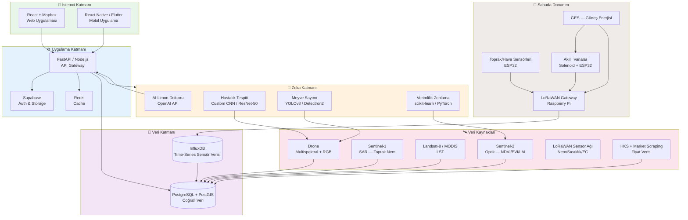
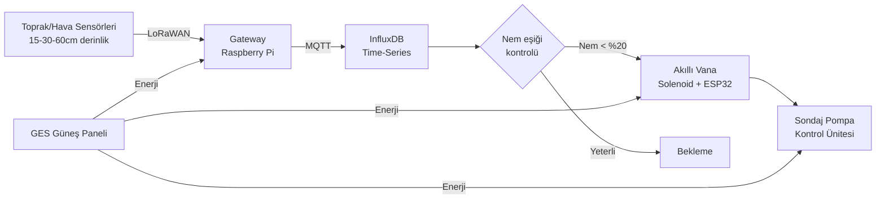
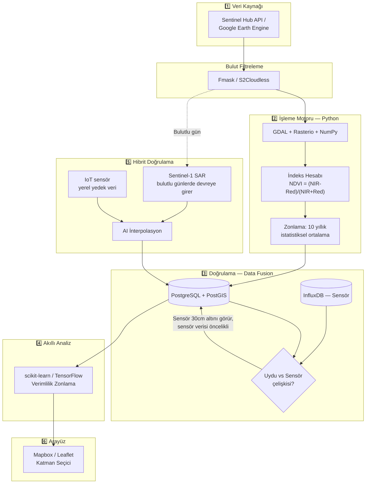

# 🍋 Bahçe İkizi (Garden Digital Twin)

**Narenciye bahçeleri için uydu, drone ve IoT verisini tek bir dijital ikizde birleştiren akıllı tarım platformu**

[](#)
[](#-proje-yol-haritas%C4%B1-3-fazl%C4%B1-geli%C5%9Ftirme)
[](#-lisans)
[](#-teknoloji-yığını)

---

## 📖 İçindekiler

- [Proje Hakkında](#-proje-hakkında)
- [Neden Bu Proje?](#-neden-bu-proje)
- [Sistem Mimarisi](#-sistem-mimarisi)
- [Faz Bazlı Özellikler](#-faz-bazlı-özellikler)
  - [Faz 1 — Platform (Web + Mobil)](#faz-1--platform-web--mobil)
  - [Faz 2 — Drone Tabanlı Haritalama](#faz-2--drone-tabanlı-gelişmiş-haritalama-ve-verim-zekası)
  - [Faz 3 — IoT ve Akıllı Sulama](#faz-3--iot-sensörler-ve-akıllı-sulama)
- [Veri İşleme Pipeline'ı](#-veri-i̇şleme-pipelineı)
- [Dijital Sağlık Skoru — 8 Katmanlı Uydu Analizi](#-dijital-sağlık-skoru--8-katmanlı-uydu-analizi)
- [Harita Katmanları Evrimi](#-harita-katmanları-evrimi-3-faz-boyunca)
- [Teknoloji Yığını](#-teknoloji-yığını)
- [Proje Yapısı](#-proje-yapısı)
- [Kurulum](#-kurulum)
- [Pilot Bölge](#-pilot-bölge)
- [Maliyet Analizi](#-maliyet-analizi-pilot--1-bahçe-27-ha)
- [Yol Haritası](#-proje-yol-haritası-3-fazlı-geliştirme)
- [Gelecek Vizyonu](#-gelecek-vizyonu)
- [Katkıda Bulunma](#-katkıda-bulunma)
- [Lisans](#-lisans)
- [İletişim](#-i̇letişim)

---

## 🎯 Proje Hakkında

**Bahçe İkizi**, narenciye (özellikle limon) üreticileri için geliştirilen, çiftçinin bahçesini uçtan uca dijitalleştiren bir **dijital ikiz (digital twin)** platformudur. Proje; uydu görüntüleme, drone tabanlı hassas tarım ve IoT sensör ağlarını **3 kademeli bir yol haritasıyla** tek bir haritada birleştirir:

> **Yer üstü** (uydu + drone) + **Yer altı** (toprak sensörleri) + **Aktif sistem** (akıllı sulama) = **Tek birleşik sağlık skoru**

Her faz bağımsız olarak geliştirilip test edilir ve bir önceki fazın üzerine **veri katmanı olarak** eklenir — böylece platform, düşük maliyetli bir web/mobil uygulamadan başlayıp tam otonom bir akıllı bahçe sistemine kadar kademeli olarak büyür.

**Pilot bölge:** Mersin, Erdemli, Tömük Köyü — 2.66 ha, 847 ağaç, Yediveren çeşidi, 12 yıllık bahçe.

---

## 🌱 Neden Bu Proje?

Geleneksel narenciye üretiminde çiftçiler şu sorunlarla karşılaşıyor:

| Problem | Bahçe İkizi Çözümü |
|---|---|
| Hastalık/su stresi geç fark ediliyor, bahçenin tamamı gezilemiyor | Uydu tabanlı NDVI/NDWI ısı haritaları ile kuşbakışı erken teşhis |
| Hasat miktarı ve geliri tahmin edilemiyor | Drone + YOLO ile ağaç başı meyve sayımı ve gelir projeksiyonu |
| İlaçlama tüm bahçeye yapılıyor, maliyet ve çevresel etki yüksek | Hastalık haritasına göre **sadece etkilenen bölgeye** akıllı ilaçlama planı (%85 tasarruf potansiyeli) |
| Sulama tahmine dayalı, su israfı var | IoT nem sensörleri + akıllı vanalarla milimetrik, bölge bazlı sulama |
| Banka/ihracat için tarlanın "verimlilik kanıtı" yok | Tarla Pasaportu: geçmiş uydu verisine dayalı, PDF çıktılı verimlilik skoru |
| Çiftçi teknik desteğe anında ulaşamıyor | 7/24 AI Limon Doktoru chatbot + gerektiğinde canlı ziraat mühendisi |

---

## 🏗️ Sistem Mimarisi



---

## 📦 Faz Bazlı Özellikler

Proje **3 bağımsız fazda** geliştirilir; her faz kendi içinde tamamlanır, test edilir ve bir önceki fazla birleştirilir.

```mermaid
gantt
    title Bahçe İkizi — Geliştirme Fazları
    dateFormat  X
    axisFormat  %s
    section Faz 1
    Platform (Web + Mobil)         :active, f1, 0, 3
    section Faz 2
    Drone & Verim Zekası           :f2, after f1, 3
    section Faz 3
    IoT & Akıllı Sulama            :f3, after f2, 3
```



### Faz 1 — Platform (Web + Mobil)

**Hedef:** Uydu verisiyle çalışan, hemen değer üreten bir MVP.

<details>
<summary><b>🗺️ Tarlam — Dijital Operasyon Merkezi</b></summary>

- Harita üzerinde parsel sınırı (poligon) çizme, ağaç sayısı/tür/yaş girişi
- **8 katmanlı uydu sağlık analizi:** NDVI, NDWI, EVI, LAI, LST, SAR toprak nemi, Phenology (mevsimsel takip), 10 yıllık zaman serisi trend analizi
- **Tarla Pasaportu:** Geçmiş verimlilik skoru (100 üzerinden), banka/kira için PDF kanıt raporu
- İşletme & finans takibi (işçilik, gider, kâr/zarar)
- **Üretim Kayıt Defteri:** Barkod okuma ile ilaç/dozaj kaydı, AB ihracat uyumluluk raporu
- Offline saha defteri (fotoğraf/ses notu, internet gelince senkron)
</details>

<details>
<summary><b>📈 Pazar ve Haber Zekası</b></summary>

- **Limon Borsası:** HKS (Hal Kayıt Sistemi) + market fiyat scraping (Migros, Bim, A101...) karşılaştırması
- Küresel sektör bülteni (İspanya, Arjantin, G. Afrika rekolte/fiyat verisi)
- Yerel sektör bülteni (fuarlar, devlet destekleri)
- AI Haber Asistanı: haberin çiftçiye etkisini 2 cümlede özetler
</details>

<details>
<summary><b>🩺 Teknik Destek ve Uzmanlık</b></summary>

- **AI Limon Doktoru:** Sola (OneSoil) tarzı chatbot arayüzü, fotoğrafla hastalık teşhisi
  - Tespit edilen hastalıklar: Trips, Limon Uyuzu, Kırmızı Örümcek, Kök Çürüklüğü, Apaç (Kanser)
- Uzmanına Sor: AI'nın çözemediği durumlarda ziraat mühendisi randevusu
- Hastalık veritabanı (Faz 2 AI model eğitimi için etiketlenmiş veri)
</details>

<details>
<summary><b>⚖️ Karar Destek ve Verimlilik</b></summary>

- Bahçeye özel budama/sulama/hasat takvimi + push bildirimleri
- Hassas dozaj hesaplayıcı (ağaç sayısı × tür × ilaç markası)
- PHI (İlaç Etkinlik Süresi) geri sayımı + AB MRL uyarısı
- Karşılaştırmalı meteoroloji, don/afet risk uyarısı, 7 günlük tahmin
</details>

<details>
<summary><b>👥 Topluluk, Rehber ve Devlet Entegrasyonu</b></summary>

- Agri-Akademi: 1 dakikalık sertifikalı eğitim videoları
- Servis/ekipman rehberi (traktör ustası, gübre bayisi, lojistik)
- Çiftçi Meydanı: moderasyonlu forum
- **E-Ziraat:** T.C. Tarım Bakanlığı / ÇKS / TARSİM entegrasyonu, destek başvuru takibi
- Hal entegrasyonu + soğuk hava deposu takibi
</details>

### Faz 2 — Drone Tabanlı Gelişmiş Haritalama ve Verim Zekası

**Hedef:** Tarlayı "hasat planı çıkaran bir makineye" dönüştürmek.

| Modül | Teknoloji | Çıktı |
|---|---|---|
| **Meyve Sayımı** | YOLOv8 / Faster R-CNN, 50-80m irtifa, orthomosaic | Ağaç başı meyve sayısı, toplam rekolte tahmini (%85-92 doğruluk) |
| **Boyut & Olgunluk Analizi** | RGB→HSV piksel/renk analizi | İhracatlık / iç piyasa / sanayi kalite dağılımı |
| **Gelir Projeksiyonu** | HKS + market fiyat entegrasyonu | İyimser / gerçekçi / kötümser senaryolu gelir dashboard'u |
| **Ağaç Başı Numaralandırma** | Computer vision + GPS RTK | Benzersiz ID (örn. `TOM-001`), cm hassasiyetinde konum |
| **DSM/DTM Analizi** | Fotogrametri | Eğim, su akış yönü, erozyon riski, ağaç hacmi |
| **Hastalık Tespiti** | Custom CNN (ResNet-50 backbone) | Ağaç başı hastalık haritası + yayılım yönü/hotspot analizi |
| **Otomatik İlaçlama Planı** | Hastalık haritası → dozaj motoru | Sadece hasta bölgeye ilaçlama → **%85 ilaç, %70 zaman, %60 su tasarrufu** |
| **Karbon (MRV)** | DSM hacim modeli + girdi bazlı emisyon hesabı | Verra VCS / Gold Standard uyumlu PDF rapor, karbon kredisi potansiyeli |

> 💡 **Maliyet Optimizasyonu Örneği:** Geleneksel ilaçlama 2.66 ha × 500 L/ha = 1.330 L iken, akıllı ilaçlama yalnızca hasta 0.4 ha'yı hedefleyerek 200 L'ye iner.

### Faz 3 — IoT, Sensörler ve Akıllı Sulama

**Hedef:** Tamamen otonom, güneş enerjili akıllı bahçe.



- **Sensör Ağı:** 3 derinlikte (15/30/60cm) nem, sıcaklık, EC; hava istasyonu
- **LoRaWAN İletişim:** İnternetsiz bahçelerde düşük enerjili, uzun menzilli veri akışı
- **Akıllı Vana:** Bölge bazlı otomatik sulama, manuel override
- **Sondaj/Pompa Kontrolü:** Kuru çalışma, aşırı basınç, voltaj koruması
- **GES (Güneş Enerjisi):** Şebeke bağımsız, batarya yedekli sistem
- **Veri Monetizasyonu:** Anonim veri satışı (meteoroloji, gübre, ilaç, sigorta şirketlerine), kooperatif raporları, karbon kredisi danışmanlığı
- **SaaS/Platform Genişlemesi:** Temel/Profesyonel/Kurumsal paketler, beyaz etiket kooperatif çözümü, API ekosistemi

---

## 🔄 Veri İşleme Pipeline'ı



**Kritik prensip:** Uydu verisi tek başına *tahmindir*. Bunu *kesin bilgiye* dönüştürmek için IoT sensör verisiyle çapraz doğrulama yapılır — çelişki durumunda sensör verisi esas alınır (çünkü toprağın 30cm altını doğrudan ölçer).

---

## 🛰️ Dijital Sağlık Skoru — 8 Katmanlı Uydu Analizi

| # | İndeks | Ölçtüğü | Formül / Yöntem | Kaynak |
|---|---|---|---|---|
| 1.1 | **NDVI** | Bitki sağlığı/yoğunluğu | `(NIR - Red) / (NIR + Red)` | Sentinel-2 B8/B4 |
| 1.2 | **NDWI** | Su içeriği | `(NIR - SWIR) / (NIR + SWIR)` | Sentinel-2 B8/B11 |
| 1.3 | **EVI** | Gelişmiş bitki sağlığı (sık dikim) | `2.5 × (NIR-Red)/(NIR+6×Red-7.5×Blue+1)` | Sentinel-2 |
| 1.4 | **LAI** | Yaprak yoğunluğu / fotosentez kapasitesi | PROSAIL modeli / NDVI-LAI regresyonu | Sentinel-2 B3/B4/B5 |
| 1.5 | **LST** | Toprak yüzey sıcaklığı | Split-Window algoritması | Landsat-8 TIRS / MODIS |
| 1.6 | **SAR Toprak Nemi** | Bulut altı nem seviyesi | Water Cloud Model | Sentinel-1 VV/VH |
| 1.7 | **Phenology** | Çiçeklenme/hasat dönemi tespiti | Savitzky-Golay filtreleme (SOS/EOS) | NDVI zaman serisi |
| 1.8 | **Zaman Serisi Trend** | Aylık/yıllık gelişim karşılaştırması | 10 yıllık istatistiksel zonlama | Tüm indeksler |

---

## 🗺️ Harita Katmanları Evrimi (3 Faz Boyunca)

```mermaid
flowchart TB
    subgraph F1["🛰️ Faz 1 Sonrası — Temel Uydu Haritası"]
        L1[NDVI • NDWI • EVI • LAI • LST • SAR<br/>Phenology • Parsel Poligonu]
    end
    subgraph F2["🚁 Faz 2 Sonrası — Drone Detay Haritası"]
        L2[Faz 1 +<br/>Ağaç Başı Numara/Sağlık • Hastalık Haritası<br/>DSM/Eğim • Karbon • Verim Tahmini<br/>Meyve Sayımı • Olgunluk • İlaçlama Planı]
    end
    subgraph F3["📡 Faz 3 Sonrası — Birleşik Dijital İkiz"]
        L3[Faz 1+2 +<br/>Yer Altı: Nem/Sıcaklık/pH/EC (3 derinlik)<br/>Aktif Sistem: Vana Durumu • GES<br/>= TEK BİRLEŞİK SAĞLIK SKORU]
    end
    F1 -->|Drone verisi eklenir| F2
    F2 -->|IoT verisi eklenir| F3

    style F1 fill:#e3f2fd
    style F2 fill:#e8f5e9
    style F3 fill:#fff3e0
```

---

## 🧰 Teknoloji Yığını

<table>
<tr><th>Katman</th><th>Faz</th><th>Teknolojiler</th></tr>
<tr><td><b>Backend</b></td><td>1</td><td>FastAPI (Python) / Node.js</td></tr>
<tr><td><b>Veritabanı</b></td><td>1</td><td>PostgreSQL + PostGIS (coğrafi veri)</td></tr>
<tr><td><b>Cache</b></td><td>1</td><td>Redis</td></tr>
<tr><td><b>Auth & Storage</b></td><td>1</td><td>Supabase</td></tr>
<tr><td><b>Frontend Web</b></td><td>1</td><td>React + Mapbox</td></tr>
<tr><td><b>Frontend Mobil</b></td><td>1</td><td>React Native / Flutter</td></tr>
<tr><td><b>AI (Chatbot/Özet)</b></td><td>1</td><td>OpenAI API</td></tr>
<tr><td><b>Scraping</b></td><td>1</td><td>Scrapy</td></tr>
<tr><td><b>Uydu Verisi</b></td><td>1</td><td>Sentinel-2 API, Sentinel-1 SAR API, MODIS/Landsat</td></tr>
<tr><td><b>Drone SDK</b></td><td>2</td><td>DJI SDK / Pix4D</td></tr>
<tr><td><b>Görüntü İşleme</b></td><td>2</td><td>OpenCV, TensorFlow</td></tr>
<tr><td><b>Haritalama</b></td><td>2</td><td>OpenDroneMap / QGIS</td></tr>
<tr><td><b>Hastalık Tespiti</b></td><td>2</td><td>Custom CNN (ResNet-50 backbone, transfer learning)</td></tr>
<tr><td><b>Nesne Algılama</b></td><td>2</td><td>YOLOv8 / Detectron2</td></tr>
<tr><td><b>Sensör İletişimi</b></td><td>3</td><td>LoRaWAN (SX1276/SX1262)</td></tr>
<tr><td><b>Gateway</b></td><td>3</td><td>Raspberry Pi + LoRaWAN HAT / TTN Gateway</td></tr>
<tr><td><b>Real-time Data</b></td><td>3</td><td>MQTT + InfluxDB (time-series)</td></tr>
<tr><td><b>Edge Computing</b></td><td>3</td><td>ESP32</td></tr>
<tr><td><b>Enerji</b></td><td>3</td><td>Solar panel + MPPT + LiFePO4 batarya</td></tr>
<tr><td><b>Hava Durumu API</b></td><td>Tümü</td><td>OpenWeatherMap / Meteoblue</td></tr>
<tr><td><b>Dış Entegrasyonlar</b></td><td>Tümü</td><td>HKS API, E-Devlet/Tarım Bakanlığı, Ziraat Bankası, TARSİM, Stripe/PayTR</td></tr>
</table>

---

## 📁 Proje Yapısı

> Aşağıdaki yapı, önerilen monorepo organizasyonunu gösterir — repodaki gerçek klasörlere göre güncelleyin.

```
bahce-ikizi/
├── apps/
│   ├── web/                 # React + Mapbox web uygulaması
│   └── mobile/               # React Native / Flutter mobil app
├── services/
│   ├── api-gateway/           # FastAPI ana servis
│   ├── satellite-pipeline/    # Sentinel-1/2 veri çekme & indeks hesaplama
│   ├── drone-processing/      # Orthomosaic, CNN, YOLO servisleri (Faz 2)
│   ├── iot-ingestion/         # MQTT/LoRaWAN veri toplama (Faz 3)
│   └── chatbot/               # AI Limon Doktoru servisi
├── infra/
│   ├── postgis/                # Veritabanı şema & migration
│   ├── influxdb/               # Time-series konfigürasyonu
│   └── docker-compose.yml
├── firmware/                   # ESP32 / sensör kodları (Faz 3)
├── docs/
│   └── bahce-ikizi-dokumantasyon.pdf
└── README.md
```

---

## ⚙️ Kurulum

> Aşağıdaki adımlar örnek bir yerel geliştirme ortamı kurulumunu gösterir.

```bash
# Depoyu klonlayın
git clone https://github.com/<kullanici-adi>/bahce-ikizi.git
cd bahce-ikizi

# Backend bağımlılıkları
cd services/api-gateway
python -m venv venv && source venv/bin/activate
pip install -r requirements.txt

# Ortam değişkenlerini ayarlayın
cp .env.example .env
# SENTINEL_HUB_CLIENT_ID, SENTINEL_HUB_CLIENT_SECRET,
# SUPABASE_URL, SUPABASE_KEY, OPENAI_API_KEY vb. doldurun

# Veritabanını başlatın (PostGIS uzantılı PostgreSQL)
docker-compose up -d postgis redis

# Backend'i çalıştırın
uvicorn main:app --reload

# Frontend
cd ../../apps/web
npm install
npm run dev
```

---

## 📍 Pilot Bölge

| Özellik | Değer |
|---|---|
| Konum | Mersin, Erdemli, Tömük Köyü |
| Parsel Büyüklüğü | 2.66 ha |
| Ağaç Sayısı | 847 |
| Çeşit | Yediveren |
| Ekim Aralığı | 6×6 m |
| Bahçe Yaşı | 12 yıl |
| Toprak | Kumlu-tınlı, pH 7.2–8.0 |
| Su Kaynağı | Tömük deresi + sondaj |
| Hasat Dönemi | Ekim–Mart |
| Ana Riskler | Yaz kuraklığı, kış donu |
| Akdeniz'e Mesafe | 2.3 km (kuzeybatı) |

---

## 💰 Maliyet Analizi (Pilot — 1 Bahçe, ~2.7 ha)

| Faz | Kalem | Adet | Tahmini Maliyet (USD) |
|---|---|---|---|
| 1 | Yazılım geliştirme (Web + Mobil) | – | 8.000 – 12.000 |
| 2 | Drone (DJI Mavic 3 Multispectral) | 1 | 5.000 – 7.000 |
| 2 | Drone yazılım/AI modeli | – | 3.000 – 5.000 |
| 3 | Toprak sensör istasyonu (3 derinlik) | 4 | 1.600 |
| 3 | Hava istasyonu | 1 | 300 |
| 3 | Su debi sensörü | 2 | 200 |
| 3 | Akıllı vana (solenoid) | 4 | 400 |
| 3 | LoRaWAN gateway | 1 | 200 |
| 3 | Sondaj kontrol ünitesi | 1 | 500 |
| 3 | GES sistemi (panel + batarya) | 1 | 1.500 |
| 3 | IoT kurulum ve entegrasyon | – | 2.000 – 3.000 |
| **Toplam** | | | **~22.000 – 30.000** |

---

## 🛣️ Proje Yol Haritası (3 Fazlı Geliştirme)

- [x] **Faz 1 — Platform:** Tarlam modülü, 8 katmanlı uydu analizi, Tarla Pasaportu, AI Limon Doktoru, pazar zekası, E-Ziraat entegrasyonu
- [ ] **Faz 2 — Drone & Verim Zekası:** Meyve sayımı (YOLO), hastalık haritalama (CNN), otomatik ilaçlama planı, MRV karbon raporu
- [ ] **Faz 3 — IoT & Akıllı Sulama:** LoRaWAN sensör ağı, akıllı vana kontrolü, GES entegrasyonu, veri monetizasyonu, SaaS/kooperatif modeli

---

## 🔭 Gelecek Vizyonu

- Mersin bölgesinde **1000+ çiftçiye** ulaşmak
- Türkiye genelinde narenciye sektörüne yayılmak
- Global limon pazarında **veri sağlayıcı** konumuna gelmek
- Akıllı tarımda **standart belirleyici** olmak
- Karbon kredisi pazarında Türkiye'nin öncü platformu olmak
- Devlet destekli akıllı tarım projelerine entegre olmak

---

## 🤝 Katkıda Bulunma

Bu proje şu anda aktif geliştirme aşamasındadır. Katkı sağlamak isterseniz:

1. Depoyu fork'layın
2. Özellik dalınızı oluşturun (`git checkout -b ozellik/yeni-ozellik`)
3. Değişikliklerinizi commit'leyin (`git commit -m 'Yeni özellik eklendi'`)
4. Dalınızı push'layın (`git push origin ozellik/yeni-ozellik`)
5. Pull Request açın

---

## 📄 Lisans

Bu proje için lisans bilgisi eklenecektir. *(Örn: MIT, Apache 2.0 veya Proprietary — tercihinize göre güncelleyin.)*

---

## 📬 İletişim

Sorularınız veya iş birliği teklifleriniz için proje sahibiyle iletişime geçebilirsiniz.

---

<p align="center">
  <sub>Belge Tarihi: 2026-07-11 · Proje: Bahçe İkizi (Garden Digital Twin) · Hedef Bölge: Mersin, Erdemli, Tömük · Versiyon: 10.0</sub>
</p>
